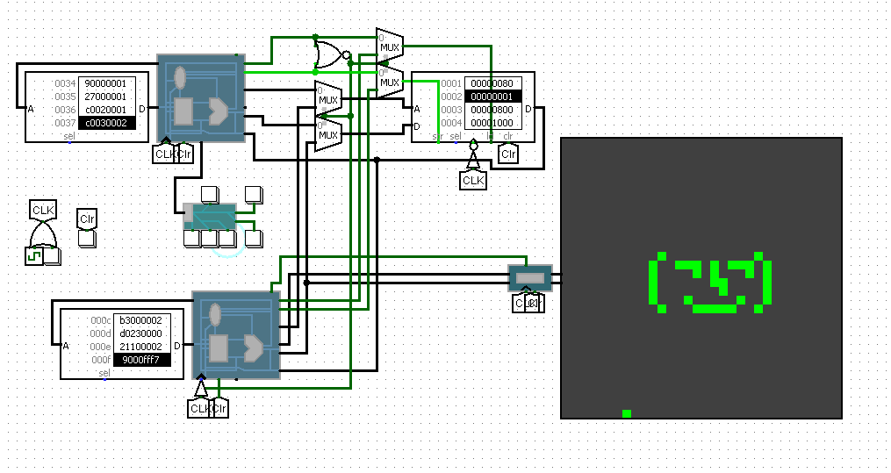
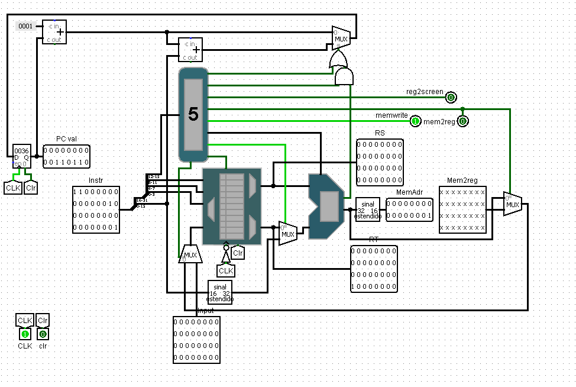
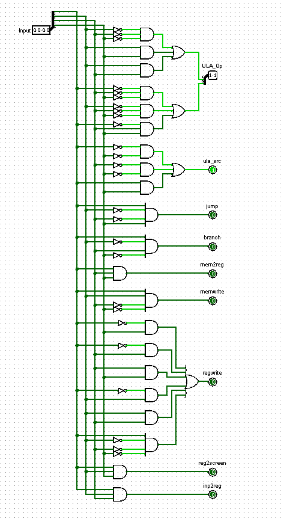
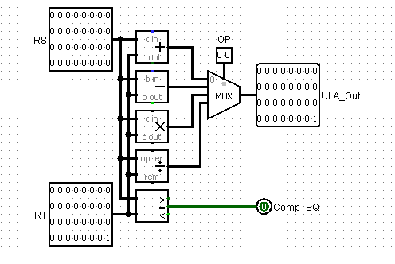
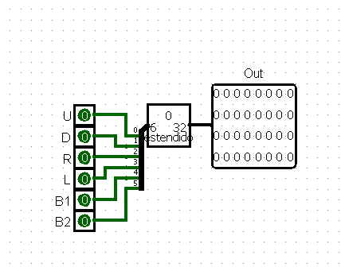
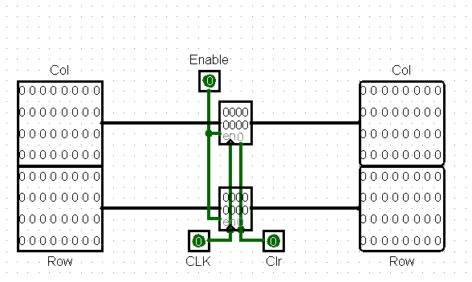

# Processador MIPS Like Dual Core
### Descrição do Projeto
Este projeto é um processador MIPS-like implementado no Logisim, que opera sem pipeline e possui um design dual core. O objetivo principal é permitir que os usuários desenhem em uma matriz de LEDs controlando um ponteiro na tela. O usuário pode salvar e apagar pontos na matriz, criando uma experiência de desenho interativa.

## Funcionalidades
### Processador MIPS-like:

- Implementação simplificada de um processador MIPS.
- Operação em modo dual core, permitindo execução paralela de tarefas.
### Controle do Ponteiro:

- Simulação de setas do teclado através de um circuito dedicado.
- O usuário pode mover o ponteiro para qualquer posição na matriz de LEDs.
### Desenho na Matriz de LEDs:

- Salvar a posição atual do ponteiro em um ponto na matriz.
- Apagar pontos em ordem do mais recente ao mais antigo.
- Repetição dos pontos salvos na tela, permitindo a criação de desenhos complexos ponto a ponto.
# Estrutura do Projeto

## Circuitos Principais
### Processador MIPS-like

## Circuitos Extras
### Circuito de Inputs

### Circuito do Display

