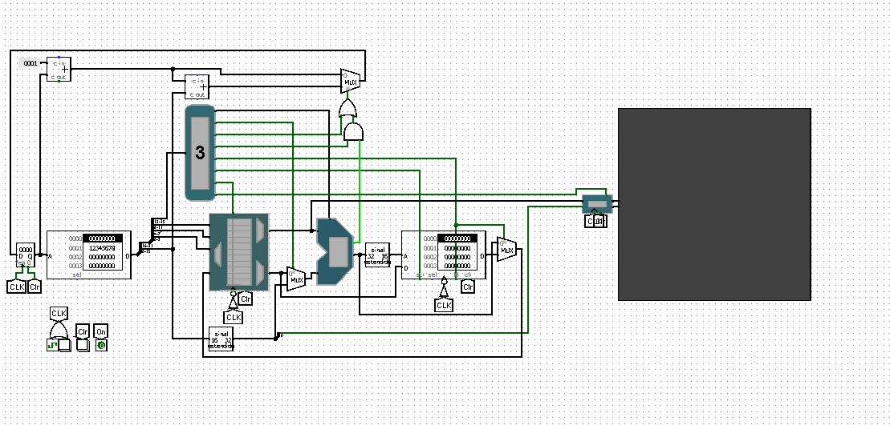
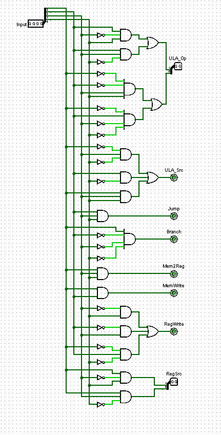
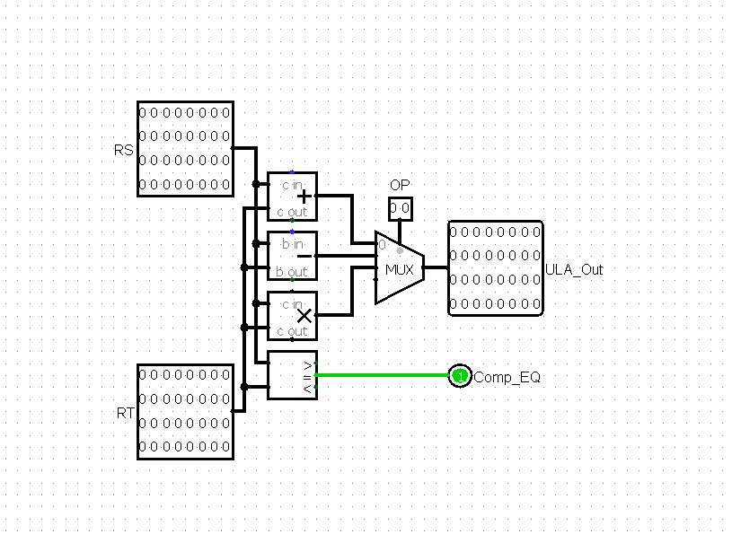
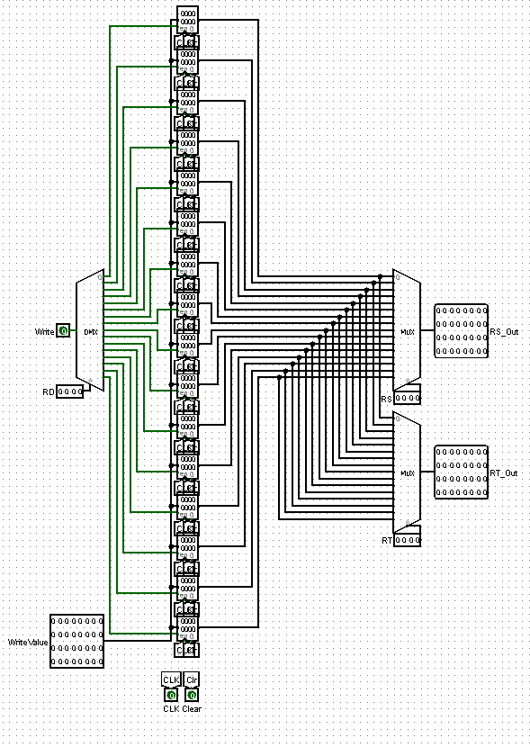

# Processador Mips no Logisim

- Vamos tentar usar ele para desenhar em uma matriz de led do logisim

## Instruction Set Architecture

### Instruction Format
* **Hexadecimal representation:** 4-digit hexadecimal number.
* **Fields:**
  * **Bits 0-3:** Opcode
  * **Bits 4-7:** Register RD
  * **Bits 8-11:** Register RS
  * **Bits 12-15:** Register RT or immediate value

### Instruction Encoding
| Opcode (Hex) | Instruction | RD | RS | RT/Imm | Description |
|---|---|---|---|---|---|
| 0000 | stall | - | - | - | Stall the pipeline |
| 0001 | add | RD | RS | RT | Add RS to RT, store in RD |
| ... | ... | ... | ... | ... | ... |
| 1110 | inpt | - | - | - | Input a value and store in register 1 |

### Examples
* **add $1, $2, $3:** 13120000
* **addi $1, $1, 5:** 21100005
* **beq $1, $2, 5:** a0120005 (Branch to 5 instructions below)
* **beq $1, $2, -5:** a012fffb (Branch to 5 instructions above)

### Notes
* **Opcode:** Determines the operation to be performed.
* **Registers:** RD, RS, and RT refer to general-purpose registers.
* **Immediate:** A constant value used for arithmetic or addressing.
* **Branch:** The `beq` instruction branches if the two registers are equal.
* **Negative offsets:** Use two's complement representation for negative offsets.

### Additional Considerations
* **Formatting:** Use a consistent formatting style for the table and code examples.
* **Completeness:** Ensure that all instructions and their corresponding fields are included.
* **Clarity:** Provide clear and concise explanations for each instruction and field.
* **Examples:** Include a variety of examples to illustrate different usage scenarios.
* **Visualization:** Consider using a diagram to visually represent the instruction format.

## Creating the Markdown Table
To create the Markdown table, you can use a Markdown table generator or manually create it using the following syntax:

```markdown
| Column 1 Header | Column 2 Header | ... |
|---|---|---|
| Cell 1, Row 1 | Cell 2, Row 1 | ... |
| Cell 1, Row 2 | Cell 2, Row 2 | ... |
  





